# OSCVPass 開源貢獻者快速通關

[專案頁說明](https://ocf.tw/p/oscvpass/) | [文件說明與參與](https://oscvpass.ocf.tw/docs/) | [申請表單](https://forms.gle/j62bUmTy1hKKGm7n6) | [已申請者專案列表](https://oscvpass.ocf.tw/)

OSCVPass (Open Source Contributor VIP Pass) 開源貢獻者快速通關計畫，是讓貢獻者提出近一年在開源領域貢獻的證明申請，申請核准後取得一年的 OSCVPass 資格後，可在合作的研討會活動參與取得回饋。

每年約有 150 - 230 位有效資格，其貢獻類型不僅止於程式碼的貢獻，也有來自開源推廣的努力。

此 Github Repo 主要為「[已申請者專案列表](https://oscvpass.ocf.tw/)」，但也包含專案未來計畫與工作任務討論的地方。或是 OCF.tw 的 [slack](https://ocftw.slack.com/) **#oscvpass** 頻道。

## 實習招募與志工夥伴

目前 OSCVPass 專案在招募實習夥伴，請參考 OCF 的[實習佈告](https://blog.ocf.tw/2023/06/intern-oscvpass.html)。

如果您對此專案有想法，也想參與貢獻成為志工，歡迎直接寄信到 [hi@ocf.tw](mailto:hi@ocf.tw) 標題開頭註明 **[OSCVPass]** 內文包含簡單的自我介紹與您的想法，我們會儘快回覆，感謝！

## 工作流程

依運作流程項目解說目前計畫面臨的問題與希望可以改善的下一步。

- ➊ 申請表單：目前是使用 Google Forms 作為申請表使用，但申請項目越來越多元，無法涵蓋表單的欄位定義與申請類型的情況。
- ➋ 審核委員：目前審核委員由社群夥伴參與，一個月一名委員負責審核，但會因為當月其他因素無法在原定時間內審核完畢。
- ➌➍ 審核方式（通過、補件、不通過）：目前審核的方式採取比較寬送的標準，無標準量化的機制。
- ➎ 寄送審核結果通知信：通知信透過 AWS SES 大量寄送樣板信件。
- ➏ 收錄開源貢獻者資料庫：目前是使用 Google Forms 表單標記已通過。
- ➐ 合作研討會：每年參與的研討會。
- ➑ 專案貢獻頁面：目前是使用靜態網頁呈現，問題在於整理與分類方式為人工手動方式進行。
- ➒ 研討會宣傳：在各研討會宣傳申請計畫。

給予實習階段時可以參與的內容：

- ➊ 申請表單：參與表單欄位定義或是後需資料分類建議與整理。
- ➋ 審核委員：參與檢討目前委員組成方式，有無其他更好的方案進行。
- ➌➍ 審核方式（通過、補件、不通過）：參與制定審核標準或是制定量化項目參考。
- ➎ 寄送審核結果通知信：Google Forms 名單整理或是改用其他方式讓寄送流程可以自動化或較親民化使用。
- ➏ 收錄開源貢獻者資料庫：參與建立標準資料格式制定或建立資料庫或表儲存申請者項目。
- ➐ 合作研討會：參與建立各研討會聯絡管道或是其他研討會合作提案。
- ➑ 專案貢獻頁面：與資料庫或表合併思考如何建立與呈現申請者的貢獻項目。
- ➒ 研討會宣傳：參與籌劃未來一年如何讓更多人知道計畫與申請。

> 計畫各項目已使用 [Project](https://github.com/orgs/ocftw/projects/3) 來進行，可參考目前我們的進度與[規劃](https://oscvpass.ocf.tw/docs/)。
