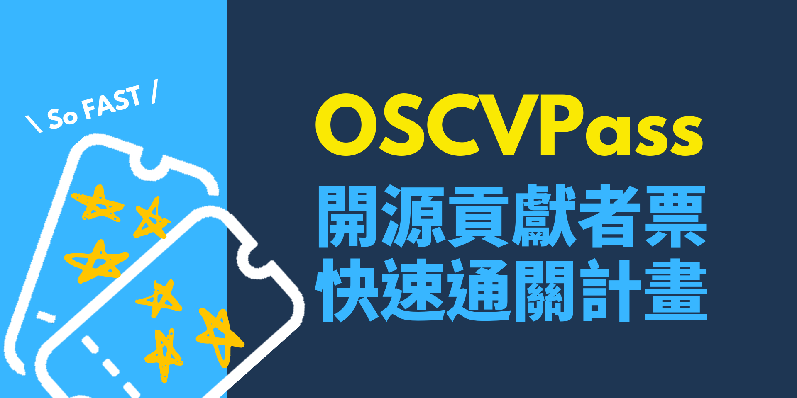

# :material-passport: 專案說明

!!! info ""

    OSCVPass 目前正在轉型調整為 2.0 方案，有興趣瞭解更多可以參考 [2.0 說明](./v2/index.md)。

{ style="border-radius: 10px;" }

為孜孜不倦的開源貢獻好夥伴們設計！在台灣，開源與開放社群十分活躍，一年會有超過十場的中大型會議、活動舉辦，也往往會有許多針對開源貢獻者的補助票券釋出。

然而以往各大活動從未統整申請這類票券的文件格式、繳交規範等，也沒有針對此環節有所合作，讓申請者需反覆彙整開源貢獻資料內容，時時關注不同活動期限再分別上傳申請，耗費許多時間心力。在繁忙的活動期間，主辦方也得分配志工去審核資格、發信提醒，更是佔用珍貴的人力。

現在，OCF 決定將繁瑣的行政庶務納為己任，啟動 OSCVPass（開源貢獻者快速通關）專案！

只要在表單中登記特定期間內，你參與的開放原始碼專案或活動之有效證明，由 OCF 募集的社群志工協助審查；確認通過者，在一年內可直接透過 OCF 申請研討會、社群活動的開源貢獻者票券，不需要再重複填資料。不僅同時減輕志工壓力、讓申請者輕鬆參加活動，更希望能憑藉 OSCVPass 的時效性與宣傳力，促進開源貢獻的更新、活絡與發展。

OCF 邀你一同加入，作伙輕鬆來開源！

[:material-account-plus: 申請與登錄](./apply.md){ .md-button }
